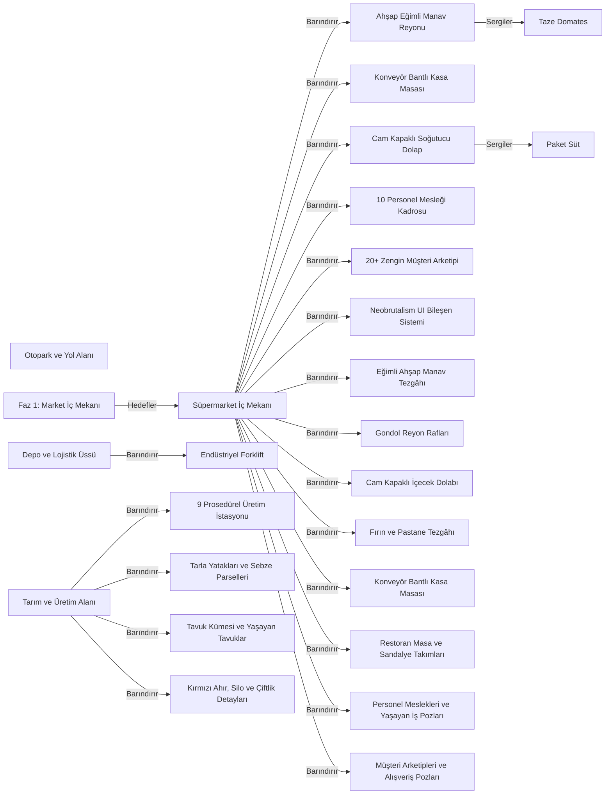

# GBLB Store 3D Procedural World Transformation — Ontoloji

Revizyon: 87. Canlı görünüm için `ontology` komutunu çalıştır.

## Türler ve özellikler

### Sahne Modülü (`scene_module`)

- name: string; zorunlu; seçenekler: None
- description: string; zorunlu; seçenekler: None
- phase: integer; zorunlu; seçenekler: None
### Prosedürel 3D Varlık (`procedural_asset`)

- name: string; zorunlu; seçenekler: None
- category: string; zorunlu; seçenekler: ['interior', 'exterior', 'vehicle', 'character', 'logistics', 'farm', 'utility']
- file_ref: string; zorunlu; seçenekler: None
### Ürün Varlığı (`product_item`)

- name: string; zorunlu; seçenekler: None
- category: string; zorunlu; seçenekler: ['produce', 'packaged', 'meat_dairy', 'cleaning', 'drinks', 'bakery']
### Kilometre Taşı (`milestone`)

- phase_number: integer; zorunlu; seçenekler: None
- verdict: string; zorunlu; seçenekler: ['planned', 'in_progress', 'completed']

## İlişki kuralları

- Barındırır (`contains`): scene_module → procedural_asset; kaynak başına 0..çok, hedef başına 0..çok; etki: forward
- Sergiler (`displays`): procedural_asset → product_item; kaynak başına 0..çok, hedef başına 0..çok; etki: none
- Hedefler (`targets`): milestone → scene_module; kaynak başına 1..çok, hedef başına 0..çok; etki: none

## Somut nesneler

- **Süpermarket İç Mekanı** (`mod-supermarket`, scene_module): {"description": "Cilalı fayans zemin, manav stantları, gondol reyonlar, içecek dolapları, kasa konveyör hattı", "name": "Supermarket Interior", "phase": 1}; durum: input; üretici: dış girdi
- **Otopark ve Yol Alanı** (`mod-parking-road`, scene_module): {"description": "Asfalt otopark şeritleri, 5+ renk araçlar, kargo kamyonu, van, sokak lambaları ve totem", "name": "Parking & Roadway", "phase": 3}; durum: input; üretici: dış girdi
- **Tarım ve Üretim Alanı** (`mod-farm-production`, scene_module): {"description": "Sera, buğday tarlaları, sebze parselleri, kırmızı ahır, su kulesi ve çiftlik hayvanları", "name": "Farm & Production", "phase": 4}; durum: input; üretici: dış girdi
- **Depo ve Lojistik Üssü** (`mod-logistics-backend`, scene_module): {"description": "Yükleme rampası, forklift, transpalet, palet rafları, atık ve geri dönüşüm merkezi", "name": "Logistics & Warehouse", "phase": 5}; durum: input; üretici: dış girdi
- **Ahşap Eğimli Manav Reyonu** (`asset-produce-shelf`, procedural_asset): {"category": "interior", "file_ref": "src/presentation/ShelfModel.js", "name": "Slanted Wooden Produce Shelf"}; durum: input; üretici: dış girdi
- **Konveyör Bantlı Kasa Masası** (`asset-checkout-counter`, procedural_asset): {"category": "interior", "file_ref": "src/presentation/RegisterModel.js", "name": "Checkout Conveyor Register"}; durum: input; üretici: dış girdi
- **Cam Kapaklı Soğutucu Dolap** (`asset-beverage-cooler`, procedural_asset): {"category": "interior", "file_ref": "src/presentation/ShelfModel.js", "name": "Glass Door Beverage Cooler"}; durum: input; üretici: dış girdi
- **Endüstriyel Forklift** (`asset-forklift`, procedural_asset): {"category": "logistics", "file_ref": "src/environment/EnvironmentProps.js", "name": "Yellow Warehouse Forklift"}; durum: input; üretici: dış girdi
- **Taze Domates** (`item-tomato`, product_item): {"category": "produce", "name": "Fresh Tomato"}; durum: input; üretici: dış girdi
- **Paket Süt** (`item-milk`, product_item): {"category": "packaged", "name": "Carton Milk"}; durum: input; üretici: dış girdi
- **Faz 1: Market İç Mekanı** (`ms-phase1`, milestone): {"phase_number": 1, "verdict": "completed"}; durum: current; üretici: T-PHASE-1
- **10 Personel Mesleği Kadrosu** (`asset-staff-roster`, procedural_asset): {"category": "character", "file_ref": "src/presentation/HumanoidFactory.js", "name": "10 Staff Professions Roster"}; durum: current; üretici: T-PHASE-6
- **20+ Zengin Müşteri Arketipi** (`asset-customer-archetypes`, procedural_asset): {"category": "character", "file_ref": "src/presentation/HumanoidFactory.js", "name": "20+ Diverse Customer Archetypes"}; durum: current; üretici: T-PHASE-6
- **Neobrutalism UI Bileşen Sistemi** (`asset-neobrutalism-ui`, procedural_asset): {"category": "utility", "file_ref": "src/style.css", "name": "Neobrutalism Design System & Components"}; durum: current; üretici: T-NEOBRUTALISM-UI
- **9 Prosedürel Üretim İstasyonu** (`asset-production-stations`, procedural_asset): {"category": "farm", "file_ref": "src/presentation/ProductionBuildModel.js", "name": "9 Procedural Production Stations & Living Animations"}; durum: needs_review; üretici: T-PRODUCTION-STATIONS-REDESIGN
- **Tarla Yatakları ve Sebze Parselleri** (`asset-farm-fields`, procedural_asset): {"category": "farm", "file_ref": "src/presentation/FarmBuildModel.js", "name": "Procedural Farm Fields & Vegetable Plots"}; durum: needs_review; üretici: T-FARM-ASSETS-ANIMATIONS-REDESIGN
- **Tavuk Kümesi ve Yaşayan Tavuklar** (`asset-chicken-coop`, procedural_asset): {"category": "farm", "file_ref": "src/presentation/ChickenCoopModel.js", "name": "Chicken Coop & Living Chickens"}; durum: needs_review; üretici: T-FARM-ASSETS-ANIMATIONS-REDESIGN
- **Kırmızı Ahır, Silo ve Çiftlik Detayları** (`asset-barn-silo-paddock`, procedural_asset): {"category": "farm", "file_ref": "src/environment/EnvironmentProps.js", "name": "Red Barn, Silo & Horse Paddock"}; durum: needs_review; üretici: T-FARM-ASSETS-ANIMATIONS-REDESIGN
- **Eğimli Ahşap Manav Tezgâhı** (`asset-produce-shelf-redesign`, procedural_asset): {"category": "interior", "file_ref": "src/presentation/ShelfModel.js", "name": "Eğimli Ahşap Manav Tezgâhı"}; durum: current; üretici: T-SUPERMARKET-FIXTURES-REDESIGN
- **Gondol Reyon Rafları** (`asset-gondola-shelf-redesign`, procedural_asset): {"category": "interior", "file_ref": "src/presentation/ShelfModel.js", "name": "Gondol Reyon Rafları"}; durum: current; üretici: T-SUPERMARKET-FIXTURES-REDESIGN
- **Cam Kapaklı İçecek Dolabı** (`asset-beverage-cooler-redesign`, procedural_asset): {"category": "interior", "file_ref": "src/presentation/ShelfModel.js", "name": "Cam Kapaklı İçecek Dolabı"}; durum: current; üretici: T-SUPERMARKET-FIXTURES-REDESIGN
- **Fırın ve Pastane Tezgâhı** (`asset-bakery-counter-redesign`, procedural_asset): {"category": "interior", "file_ref": "src/presentation/ShelfModel.js", "name": "Fırın ve Pastane Tezgâhı"}; durum: current; üretici: T-SUPERMARKET-FIXTURES-REDESIGN
- **Konveyör Bantlı Kasa Masası** (`asset-checkout-counter-redesign`, procedural_asset): {"category": "interior", "file_ref": "src/presentation/RegisterModel.js", "name": "Konveyör Bantlı Kasa Masası"}; durum: current; üretici: T-SUPERMARKET-FIXTURES-REDESIGN
- **Restoran Masa ve Sandalye Takımları** (`asset-restaurant-furniture-redesign`, procedural_asset): {"category": "interior", "file_ref": "src/presentation/DiningTableModel.js", "name": "Restoran Masa ve Sandalye Takımları"}; durum: current; üretici: T-SUPERMARKET-FIXTURES-REDESIGN
- **Personel Meslekleri ve Yaşayan İş Pozları** (`asset-staff-animations-redesign`, procedural_asset): {"category": "character", "file_ref": "src/presentation/HumanoidFactory.js", "name": "Personel Meslekleri ve Yaşayan İş Pozları"}; durum: current; üretici: T-CHARACTERS-ANIMATIONS-LIVING-WORLD
- **Müşteri Arketipleri ve Alışveriş Pozları** (`asset-customer-animations-redesign`, procedural_asset): {"category": "character", "file_ref": "src/presentation/HumanoidFactory.js", "name": "Müşteri Arketipleri ve Alışveriş Pozları"}; durum: current; üretici: T-CHARACTERS-ANIMATIONS-LIVING-WORLD

## Nesne haritası

Oklar kayıtlı ilişki yönüdür; değişiklik etkisinin yönü üstte ayrıca tanımlıdır.

## Görevlerin veri bağları

- **T-PHASE-1 — Faz 1: Süpermarket İç Mekan ve Ekipman Mimarisinin Kurulması**: girdiler [mod-supermarket], çıktılar [ms-phase1], durum done.
- **T-PHASE-2 — Faz 2: 3D Ürün Varlıklarının Geliştirilmesi ve Reyon Yerleşimi**: girdiler [item-tomato], çıktılar [], durum done.
- **T-PHASE-3 — Faz 3: Dış Mekan, Otopark, Yollar ve Araç Filosu**: girdiler [mod-parking-road], çıktılar [], durum done.
- **T-PHASE-4 — Faz 4: Tarım ve Üretim Çiftliği Bölgesi**: girdiler [mod-farm-production], çıktılar [], durum done.
- **T-PHASE-5 — Faz 5: Arka Alan, Depo ve Lojistik Tesisleri**: girdiler [mod-logistics-backend], çıktılar [], durum done.
- **T-PHASE-6 — Faz 6: 10 Personel Mesleği ve 20+ Zengin Müşteri Tipi**: girdiler [mod-supermarket], çıktılar [asset-staff-roster, asset-customer-archetypes], durum done.
- **T-NEOBRUTALISM-UI — Kullanıcı Arayüzünün Neobrutalism Bileşen Mimarisine Dönüştürülmesi**: girdiler [mod-supermarket], çıktılar [asset-neobrutalism-ui], durum done.
- **T-NEOBRUTALISM-ICONS-LOGOS — İkon, Logo ve Simgelerin Neobrutalist SVG Sistemine Dönüştürülmesi ve Emojilerin Temizlenmesi**: girdiler [mod-supermarket], çıktılar [], durum done.
- **T-NEOBRUTALISM-STATION-BADGES — İstasyon ve Üretim Etiketlerinin Neobrutalist Kompakt İkonlu Göstergelere Dönüştürülmesi**: girdiler [mod-supermarket], çıktılar [], durum needs_review.
- **T-PRODUCTION-STATIONS-REDESIGN — 9 Üretim İstasyonunun Referans Görsele Göre Yeniden Tasarlanması ve Sinematik Hareketli Animasyonlarının Eklenmesi**: girdiler [mod-farm-production], çıktılar [asset-production-stations], durum needs_review.
- **T-FARM-ASSETS-ANIMATIONS-REDESIGN — Tarla Yatakları, Meyve Bahçesi, Tavuk Kümesi ve Ahır Detaylarının Referansa Göre Yenilenmesi ve Canlı Animasyonları**: girdiler [mod-farm-production], çıktılar [asset-farm-fields, asset-chicken-coop, asset-barn-silo-paddock], durum needs_review.
- **T-SUPERMARKET-FIXTURES-REDESIGN — Market Demirbaşlarının Referans Görsele Göre Yeniden Tasarlanması (Manav, Gondol, Soğuk Dolap, Pastane, Kasa, Restoran)**: girdiler [mod-supermarket], çıktılar [asset-produce-shelf-redesign, asset-gondola-shelf-redesign, asset-beverage-cooler-redesign, asset-bakery-counter-redesign, asset-checkout-counter-redesign, asset-restaurant-furniture-redesign], durum done.
- **T-CHARACTERS-ANIMATIONS-LIVING-WORLD — Personel ve Müşteri Varlıklarının Referans Görsele Göre Geliştirilmesi, Özgün Poz ve Sinematik Hareket Animasyonlarının Uygulanması**: girdiler [mod-supermarket], çıktılar [asset-staff-animations-redesign, asset-customer-animations-redesign], durum done.

Etki yeniden inceleme ihtiyacıdır; nesnenin yanlış olduğu hükmü değildir.
